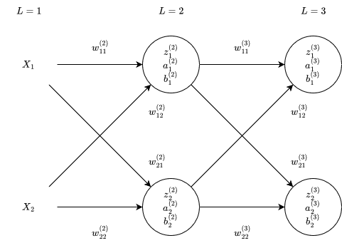

# No Code Machine Learning

Suppose we have this sample network:

<p align="center">
  
  
  <p align="center">
    <sup>$X$...inputs</sup>
</p>
</p>

<!-- definition of the activation -->
```math
a^{(l)}_j = f_l(z^{(l)}_j)
```

Where $f_l$ is the activation function for layer $l$, e.g., sigmoid:

<!-- example of activation with the sigmoid activation function -->
```math
a^{(l)}_j = \sigma(z^{(l)}_j)
```

<!-- definition of z -->
```math
z^{(l)}_j = \sum_{k = 0}^{n_{l - 1} - 1} (a^{(l - 1)}_k w^{(l)}_{jk}) + b^{(l)}_j
```
<p align="center">
  <sup>$n_l$...number of inputs in the layer $l$</sup>
</p>

<p align="center">
  <sup>$l$...any layer in the network</sup>
</p>

## All formulas for all a and z values

### $L = 0$
<!-- formula for a^{(0)}_0 -->
```math
a^{(0)}_0 = f_0(z^{(0)}_0)
```

<!-- formula for z^{(0)}_0 -->
```math
z^{(0)}_0 = {
  X_0 w^{(0)}_{00} + 
  X_1 w^{(0)}_{01} + 
  b^{(0)}_0
}
```

<!-- formula for a^{(0)}_1 -->
```math
a^{(0)}_1 = f_0(z^{(0)}_1)
```

<!-- formula for z^{(1)}_1 -->
```math
z^{(0)}_1 = {
  X_0 w^{(0)}_{10} + 
  X_1 w^{(0)}_{11} + 
  b^{(0)}_1
}
```

### $L = 1$
<!-- formula for a^{(1)}_0 -->
```math
a^{(1)}_0 = f_1(z^{(1)}_0)
```

<!-- formula for z^{(1)}_0 -->
```math
z^{(1)}_0 = {
  a^{(0)}_0 w^{(1)}_{00} + 
  a^{(0)}_1 w^{(1)}_{01} + 
  b^{(1)}_0
}
```

<!-- formula for a^{(3)}_1 -->
```math
a^{(1)}_1 = f_1(z^{(1)}_1)
```

<!-- formula for z^{(3)}_1 -->
```math
z^{(1)}_1 = {
  a^{(0)}_0 w^{(1)}_{10} + 
  a^{(0)}_1 w^{(1)}_{11} + 
  b^{(1)}_1
}
```

## Activation functions and their derivatives

The activation function is noted as $f_l$ (activation function for the layer $l$). The derivative is noted as $f'_{l}$.
 
### Sigmoid

<!-- definition of sigmoid activation function -->
```math
\sigma(z) = \frac{1}{1 + e^{-z}}
```

<!-- derivative of sigmoid -->
```math
\sigma'(z) = \sigma(z)(1 - \sigma(z))
```

### ReLU

<!-- definition of relu activation function -->
```math
ReLU(z) = max(0, z)
```

<!-- derivative of relu -->
```math
ReLU'(z) = \left\{
  \begin{array}{ l l }
    1 \qquad \textrm{if $z > 0$} \\ 0 \qquad \textrm{if $z \leq 0$*}
  \end{array}
\right.
```

<p align="center">
  <sup>*The derivative at zero is not defined. The predefined function in the program returns 0.</sup>
</p>

## Derivatives of cost functions

### Mean Squared Error (MSE)

<!-- the definition of mse -->
```math
C = MSE = {
  \frac{1}{n_L}
  \sum_{j = 0}^{n_L-1}(a^{(L)}_j - y_j)^2
}
```

<p align="center">
  <sup>$y$...the expected values</sup>  
</p>

<!-- the derivative of mse -->
```math
\frac{\partial C}{\partial a^{(L)}_j} = 2(a^{(L)}_j - y_j)
```

<br>

<!-- partial derivative of C with respect to w^{(L)}_{jk} -->
```math
\frac{\partial C}{\partial w^{(L)}_{jk}} = {
  \frac{\partial C}{\partial a^{(L)}_j}
  \frac{\partial a^{(L)}_j}{\partial z^{(L)}_j}
  \frac{\partial z^{(L)}_j}{\partial w^{(L)}_{jk}}
} = {
  2(a^{(L)}_j - y_j)
  f_L'(z^{(L)}_j)
  a^{(L - 1)}_k
}
```

<!-- partial derivative of C with respect to b^{(L)}_j -->
```math
\frac{\partial C}{\partial b^{(L)}_j} = {
  \frac{\partial C}{\partial a^{(L)}_j}
  \frac{\partial a^{(L)}_j}{\partial z^{(L)}_j}
  \frac{\partial z^{(L)}_j}{\partial b^{(L)}_j}
} = {
  2(a^{(L)}_j - y_j)
  f_L'(z^{(L)}_j)
  1
} = {
  2(a^{(L)}_j - y_j)
  f_L'(z^{(L)}_j)
}
```

<!-- partial derivative of C with respect to a^{(L - 1)}_k -->
```math
\frac{\partial C}{\partial a^{(L - 1)}_k} = {
  \sum_{j=0}^{n_L - 1}
  \frac{\partial C}{\partial a^{(L)}_j}
  \frac{\partial a^{(L)}_j}{\partial z^{(L)}_j}
  \frac{\partial z^{(L)}_j}{\partial a^{(L - 1)}_k}
} = {
  \sum_{j=0}^{n_L - 1}
  2(a^{(L)}_j - y_j)
  f_L'(z^{(L)}_j)
  w^{(L)}_{jk}
}
```

For any layer $l$ in the network:

<!-- partial derivative of C with respect to w^{(l)}_{jk} -->
```math
\frac{\partial C}{\partial w^{(l)}_{jk}} = {
  \frac{\partial C}{\partial a^{(l)}_j}
  f_l'(z^{(l)}_j)
  a^{(l - 1)}_k
}
```

<!-- partial derivative of C with respect to b^{(l)}_j -->
```math
\frac{\partial C}{\partial b^{(l)}_j} = {
  \frac{\partial C}{\partial a^{(l)}_j}
  f_l'(z^{(l)}_j)
}
```

Where:

<!-- partial derivative of C with respect to a^{(l)}_k if l = L -->
```math
\frac{\partial C}{\partial a^{(l)}_j} = 2(a^{(L)}_j - y_j) \qquad 
\textrm{if $l=L$}
```

<p align="center">
  <sup>$L$...last layer of the network</sup>
</p>

<!-- partial derivative of C with respect to a^{(l)}_k if l != L -->
```math
\frac{\partial C}{\partial a^{(l)}_j} = {
  \sum_{i=0}^{n_{l + 1} - 1}
  \frac{\partial C}{\partial a^{(l + 1)}_i}
  f_{l + 1}'(z^{(l + 1)}_i)
  w^{(l + 1)}_{ij}
} \qquad
\textrm{otherwise}
```

## The backpropagation algorithm

1) iterate all layers backwards (as `l`)
   1) iterate neurons in the layer l (as `j`)
      1) compute $\frac{\partial C}{\partial a^{(l)}_j}$ and save it in an array
      2) compute $\frac{\partial C}{\partial b^{(l)}_j}$
      3) iterate neurons in the layer $l - 1$ (as `k`)
          1) compute $\frac{\partial C}{\partial w^{(l)}_{jk}}$
