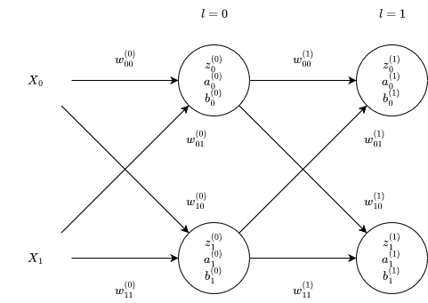

# No Code Machine Learning

Suppose we have this sample network:

<p align="center">
  
  
  <p align="center">
    <sup>$X$...inputs</sup>
</p>
</p>

<!-- definition of the activation -->
```math
a^{(L)}_j = f(z^{(L)}_j)
```

Where $f$ is the activation function, e.g., sigmoid:

<!-- example of activation with the sigmoid activation function -->
```math
a^{(L)}_j = \sigma(z^{(L)}_j)
```

<!-- definition of z -->
```math
z^{(L)}_j = \sum_{k = 0}^{n_L - 1} (a^{(L - 1)}_k w^{(L)}_{jk}) + b^{(L)}_j
```
<p align="center">
  <sup>$n_L$...number of inputs in the layer L</sup>
</p>

## All formulas for all a and z values

### $L = 3$
<!-- formula for a^{(3)}_0 -->
```math
a^{(3)}_0 = f(z^{(3)}_0)
```

<!-- formula for z^{(3)}_0 -->
```math
z^{(3)}_0 = {
  a^{(2)}_0 w^{(3)}_{00} + 
  a^{(2)}_1 w^{(3)}_{01} + 
  b^{(3)}_0
}
```

<!-- formula for a^{(3)}_1 -->
```math
a^{(3)}_1 = f(z^{(3)}_1)
```

<!-- formula for z^{(3)}_1 -->
```math
z^{(3)}_1 = {
  a^{(2)}_0 w^{(3)}_{10} + 
  a^{(2)}_1 w^{(3)}_{11} + 
  b^{(3)}_1
}
```


### $L = 2$
<!-- formula for a^{(2)}_0 -->
```math
a^{(2)}_0 = f(z^{(2)}_0)
```

<!-- formula for z^{(2)}_0 -->
```math
z^{(2)}_0 = {
  X_0 w^{(2)}_{00} + 
  X_1 w^{(2)}_{01} + 
  b^{(2)}_0
}
```

<!-- formula for a^{(2)}_1 -->
```math
a^{(2)}_1 = f(z^{(2)}_1)
```

<!-- formula for z^{(L)}_1 -->
```math
z^{(2)}_1 = {
  X_0 w^{(2)}_{10} + 
  X_1 w^{(2)}_{11} + 
  b^{(2)}_1
}
```

## Derivatives of cost functions

Suppose a universal cost function, $C$.

<!-- the derivative of root -->
```math
root = \frac{\partial C}{\partial z^{(L)}_j} = {
  \frac{\partial C}{\partial a^{(L)}_j}
  \frac{\partial a^{(L)}_j}{\partial z^{(L)}_j}
} = {
  \frac{\partial C}{\partial a^{(L)}_j}
  f'(z^{(L)}_j)
}
```

<p align="center">
  <sup>root is the common part for derivative with respect to weight, bias and activation in the previous layer</sup>
</p>

<!-- partial derivative of C with respect to w^{(L)}_{jk} -->
```math
\frac{\partial C}{\partial w^{(L)}_{jk}} = {
  root
  \frac{\partial z^{(L)}_j}{\partial w^{(L)}_{jk}}
} = {
  \frac{\partial C}{\partial a^{(L)}_j} \cdot
  f'(z^{(L)}_j) \cdot
  a^{(L - 1)}_k
}
```

<!-- partial derivative of C with respect to b^{(L)}_j -->
```math
\frac{\partial C}{\partial b^{(L)}_j} = {
  root
  \frac{\partial z^{(L)}_j}{\partial b^{(L)}_j}
} = {
  \frac{\partial C}{\partial a^{(L)}_j} \cdot
  f'(z^{(L)}_j) \cdot
  1
} = {
  \frac{\partial C}{\partial a^{(L)}_j} \cdot
  f'(z^{(L)}_j)
}
```

<!-- partial derivative of C with respect to a^{(L - 1)}_k -->
```math
\frac{\partial C}{\partial a^{(L - 1)}_k} = {
  root
  \frac{\partial z^{(L)}_j}{\partial a^{(L - 1)}_k}
} = {
  \sum_{j=0}^{n_L - 1}
  \frac{\partial C}{\partial a^{(L)}_j} \cdot
  f'(z^{(L)}_j) \cdot
  w^{(L)}_{jk}
}
```

TODO: check and explain for earlier layers

### Mean Squared Error (MSE)

<!-- the definition of mse -->
```math
C = MSE = \sum_{j = 0}^{n_L-1}(a^{(L)}_j - y_j)^2
```

<!-- the derivative of mse -->
```math
\frac{\partial C}{\partial a^{(L)}_j} = 2(a^{(L)}_j - y_j)
```
